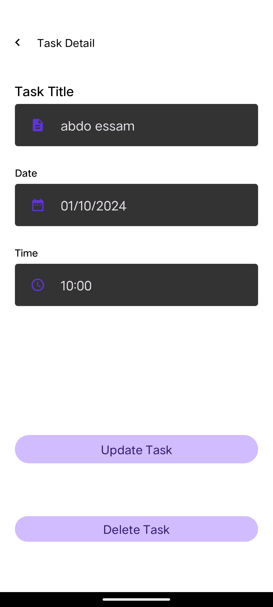

# TODO List App

This repository contains the To Do List application, a powerful and efficient task management app developed for Android. The app allows users to create, manage, and track tasks individually, helping them stay organized and productive.

## Features

- Task Creation and Management: Easily create and manage tasks with an intuitive user interface.
- Search Functionality: Quickly find tasks using the built-in search feature.
- User-Friendly Interface: A clean and simple design, making it easy to navigate and use.

# Technologies Used

The app is built using modern Android development practices and leverages the following technologies

- 🏗 MVVM (Model-View-ViewModel): A robust architectural pattern that separates the user interface logic from business logic, ensuring a clean and maintainable codebase.
- 🚨 Dagger-Hilt: Dependency injection library for managing and providing dependencies across the application, leading to better scalability and testability.
- 🗃 Room and SQLite: Database libraries for storing and managing local data with ease, offering a seamless integration with the app's architecture.
- 🕓 Coroutines: Kotlin's concurrency design pattern, allowing for smooth and efficient background operations without blocking the main thread.
- 🚀 LiveData: A lifecycle-aware component that provides updates to the UI when data changes, ensuring that the app's UI remains responsive.
- 🎨 DataBinding and ViewBinding: Tools that bind UI components to data sources in a clean and efficient manner, reducing boilerplate code.
- 📲 Navigation Component: A framework for handling all navigational needs within the app, including fragment transitions and deep linking.
- 🎴 RecyclerView: A flexible and efficient component for displaying lists of data, allowing users to view and interact with their tasks seamlessly.

## Usage

Once installed, the app allows you to:
- Add a task: Tap the "Add Task" button and fill in the task details.
- View tasks: All created tasks are displayed in a list for easy tracking.
- Edit or delete tasks: Long-press on a task to edit or delete it
- Search tasks: Use the search bar to quickly find specific tasks.

## Contributing

Contributions are welcome! If you'd like to contribute, please fork the repository and create a pull request. For major changes, please open an issue first to discuss what you would like to change.

## Screenshots

  
  
  
  

